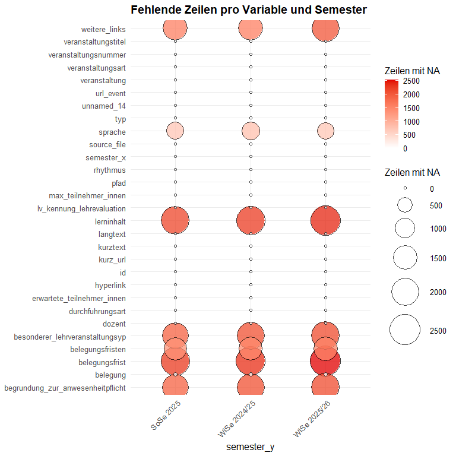

# Data Preparation Universität Koblenz
mhu
2026-03-25

# Vorbereitung

## Pakete laden

In einem ersten Schritt updaten wir `HEXCleanR` und laden die benötigten
Pakete.

``` r
# remotes::install_github("stifterverband/HEXCleanR", force = TRUE, dependencies = FALSE)
library(tidyverse)
library(HEXCleanR)
library(pointblank)
library(knitr)
```

## Daten importieren

Wir definieren den Pfad zum Ordner der Universität Koblenz und laden die
Daten mit der Funktion `load_data_from_sp()`. Anschließend bereinigen
wir die Daten, indem wir Spalten entfernen, die nur NA-Werte enthalten,
und alle Zeichenketten-Spalten zusammenziehen.

``` r
UNIVERSITY_FOLDER <- "Universitaet_Koblenz" 
BASE_PATH         <- "C:/SV/HEX/Scraping/data/single_universities"

raw_data <- load_data_from_sp(university_folder = UNIVERSITY_FOLDER) |>
  drop_full_na_columns() |>
  squish_character_columns()
```

## Daten explorieren

Wir checken auf Anzahl der Zeilen pro Semester um etwaige Scrapingfehler
früh ausfindig zu machen.s

``` r
raw_data |> 
  check_semester_n() 
```

    # A tibble: 3 × 2
      source_file                       n
      <chr>                         <int>
    1 course_data_WiSe_2025-26.json  2530
    2 course_data_WiSe_2024-25.json  2395
    3 course_data_SoSe_2025.json     2290

Mit `plot_na_balloons()` visualisieren wir die Verteilung der NAs der
Variablen über die Semester hinweg.

``` r
raw_data |>
  plot_na_balloons(grp_var = semester_y, print_table = FALSE) 
```



# Daten bereinigen

## organisation

Wir erzeugen aus `einrichtung` die Variable `organisation_orig`, indem
wir die Listen in `einrichtung` in Zeichenketten umwandeln. Anschließend
erstellen wir eine Kopie von `organisation_orig` und nennen sie
`organisation`.

Mit der Funktion `check_organisation()` überprüfen wir die Werte in der
Spalte `organisation` auf Probleme.

- `i`: Schritt-Nummer: Die fortlaufende Indexnummer des
  Validierungsschritts (hilft bei der Zuordnung zu get_data_extracts).
- `type`: Validierungs-Funktion: Die angewendete pointblank-Funktion
  (z. B. col_vals_regex oder col_vals_expr).
- `columns`: Zielspalte: Der Name der Spalte im Datensatz, auf die sich
  die Prüfung bezieht.
- `values`: Prüfwerte: Die Kriterien der Prüfung (z. B. ein regulärer
  Ausdruck oder ein Wertebereich).
- `precon`: Precondition: Zeigt an, ob vorab ein Filter auf die Daten
  angewendet wurde.
- `active`: Aktiv-Status: Ein logischer Wert (TRUE/FALSE), der angibt,
  ob dieser Schritt ausgeführt wurde.
- `eval`: Evaluation: Gibt an, ob der Check technisch ohne Fehler (“EVAL
  PASS”) durchgelaufen ist.
- `units`: Gesamtzeilen: Die Anzahl der untersuchten Zeilen (Samples)
  für diesen spezifischen Schritt.
- `n_pass`: Bestanden (Absolut): Die exakte Anzahl der Zeilen, die das
  Kriterium erfüllt haben.
- `f_pass`: Bestanden (Quote): Der Anteil der korrekten Zeilen als
  Dezimalzahl (z. B. 0.99 für 99 %).
- `W`, `S`, `N`: Schwellenwerte: Die definierten Grenzen für Warnungen
  (W), Stops (S) oder Notifications (N).
- `extract`: Extrakt-ID: Eine interne Kennung, die signalisiert, dass
  Fehlerdaten für diesen Schritt gespeichert wurden.

``` r
raw_data <- raw_data %>% 
  mutate(organisation_orig = map_chr(einrichtung, ~ paste(unlist(.x), collapse = " ; "))) |>
  mutate(organisation = organisation_orig)

orga_check <- raw_data |>
  select(!is.list) |>
  check_organisation()

orga_check |> 
  get_agent_report(display_table = FALSE) |> 
  knitr::kable()
```

| i | type | columns | values | precon | active | eval | units | n_pass | f_pass | W | S | N | extract |
|---:|:---|:---|:---|:---|:---|:---|---:|---:|---:|:---|:---|:---|---:|
| 1 | col_vals_regex | organisation | ^(?:\[^;\]*(?:;))*\[^;\]\*\$ | NA | TRUE | OK | 7215 | 7215 | 1.00000 | NA | FALSE | NA | NA |
| 2 | col_vals_regex | organisation | [^1]\*\$ | NA | TRUE | OK | 7215 | 7215 | 1.00000 | NA | FALSE | NA | NA |
| 3 | col_vals_regex | organisation | [^2]\*\$ | NA | TRUE | OK | 7215 | 7215 | 1.00000 | NA | FALSE | NA | NA |
| 4 | col_vals_between | .nchar_org | 0, 1000 | 1 | TRUE | OK | 7215 | 7215 | 1.00000 | FALSE | NA | NA | NA |
| 5 | col_vals_expr | .squished, organisation | ==, organisation, .squished | 1 | TRUE | OK | 7215 | 7215 | 1.00000 | NA | FALSE | NA | NA |
| 6 | col_vals_expr | organisation | !, stringr::str_detect(organisation, stringr::regex(“(?\<!\p{L})(Bachelor\|Master\|Diplom\|B\\A\|M\\A\|Deutsch\|Englisch\|Französisch\|Spanisch\|Italienisch\|Russisch\|T(?:ü\|ue)rkisch\|Portugiesisch\|Niederl(?:ä\|ae)ndisch)(?!\p{L})”, ignore_case = TRUE)) | NA | TRUE | OK | 7215 | 7180 | 0.99515 | TRUE | NA | NA | 35 |

Tatsächlich gibt step 6 ein Warning, das non-orga-Patterns geflaggt
wurden. Wir checken die entsprechenden Einträge.

``` r
orga_check |> 
  get_data_extracts(i = 6) |>
  select(organisation_orig) |>
  distinct()
```

    # A tibble: 1 × 1
      organisation_orig       
      <chr>                   
    1 Lehreinheit FBG Englisch

[^1]: ^\|

[^2]: ^\>
