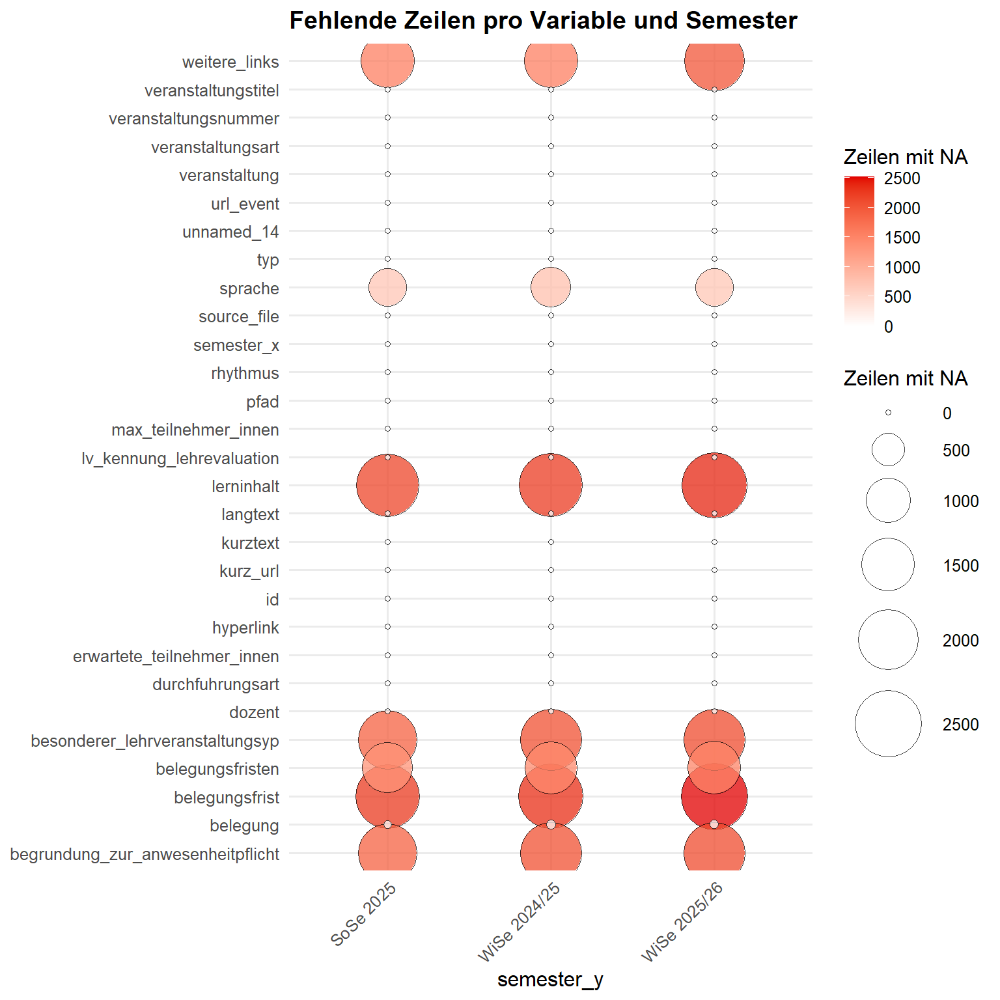

# Get started

## Hintergrund

`HEXCleanR` bündelt zentrale Arbeitsschritte für die Aufbereitung der
HEX-Daten. Das Paket unterstützt beim Laden und Vereinheitlichen von
Scraping-Daten, bei der Bereinigung von Text- und Missing-Werten, bei
explorativen Qualitätschecks sowie bei der Validierung zentraler
Variablen. Darüber hinaus enthält es Funktionen zur Ergänzung fehlender
Sprachinformationen und zur Einbindung bereits vorhandener oder neuer
Future-Skills-Klassifikationen.

Im folgenden soll eine kurzer Einstieg in die zentralen Funktionen von
`HEXCleanR` gegeben werden. Es wird exemplarisch mit den Daten der
Universität Koblenz gearbeitet, die im Rahmen des Scraping-Projekts
bereits aufbereitet wurden.

### Pakete laden

In einem ersten Schritt updaten wir `HEXCleanR`. Anschließend laden wir
das Paket sowie weitere, für das Cleaning benötigten Pakete.

``` r

# remotes::install_github("stifterverband/HEXCleanR", force = TRUE, dependencies = FALSE)

library(HEXCleanR)
library(pointblank)
library(knitr)
library(tidyverse)
```

### Daten importieren

Wir definieren den Pfad zum Ordner der Universität Koblenz und laden die
Daten mit der Funktion
[`load_data_from_sp()`](https://github.com/Stifterverband/HEXCleanR/reference/load_data_from_sp.md).
Anschließend bereinigen wir die Daten, indem wir Spalten entfernen, die
nur NA-Werte enthalten
([`drop_full_na_columns()`](https://github.com/Stifterverband/HEXCleanR/reference/drop_full_na_columns.md)),
und auf alle Stringvariablen überflüssige Leerzeichen entfernen
([`squish_character_columns()`](https://github.com/Stifterverband/HEXCleanR/reference/squish_character_columns.md)).

``` r

UNIVERSITY_FOLDER <- "Universitaet_Koblenz" 
BASE_PATH         <- "C:/SV/HEX/Scraping/data/single_universities"

raw_data <- HEXCleanR::load_data_from_sp(university_folder = UNIVERSITY_FOLDER) |>
  HEXCleanR::drop_full_na_columns() |>
  HEXCleanR::squish_character_columns()
```

### Daten explorieren

Wir checken auf Anzahl der Zeilen pro Semester
([`check_semester_n()`](https://github.com/Stifterverband/HEXCleanR/reference/check_semester_n.md)),
um etwaige Scrapingfehler oder anderweitige Unstimmigkeiten früh
ausfindig zu machen.

``` r

raw_data |> 
  HEXCleanR::check_semester_n() 
```

    # A tibble: 3 × 2
      source_file                       n
      <chr>                         <int>
    1 course_data_WiSe_2025-26.json  2530
    2 course_data_WiSe_2024-25.json  2395
    3 course_data_SoSe_2025.json     2290

Mit
[`plot_na_balloons()`](https://github.com/Stifterverband/HEXCleanR/reference/plot_na_balloons.md)
visualisieren wir die Verteilung der NAs der Variablen über die Semester
hinweg.

``` r

raw_data |>
  HEXCleanR::plot_na_balloons(grp_var = semester_y, print_table = FALSE) 
```



Okay, wir sehen keine dramatischen Auffälligkeiten: Die Fallzahlen pro
Semester sind relativ stabil, und es gibt keine Variablen, die über die
Semester hinweg stark mit Blick auf die Anzahl der NAs schwanken. Wir
gehen ins eigentliche Cleaning über.

## Daten bereinigen

Im folgenden werden exemplarisch jene Variablen bereinigt, für die
`HEXCleanR` spezifische Helper-Funktionen bereitstellt.

### organisation

Wir erzeugen aus `einrichtung` die Variable `organisation_orig`, indem
wir die Listen in `einrichtung` in Zeichenketten umwandeln. Anschließend
erstellen wir eine Kopie von `organisation_orig` und nennen sie
`organisation`.

Mit der Funktion
[`check_organisation()`](https://github.com/Stifterverband/HEXCleanR/reference/check_organisation.md)
überprüfen wir die Werte in der Spalte `organisation` auf Probleme.

``` r

raw_data <- raw_data %>% 
  mutate(organisation_orig = map_chr(einrichtung, ~ paste(unlist(.x), collapse = " ; "))) |>
  mutate(organisation = organisation_orig)

orga_check <- raw_data |>
  select(!is.list) |>
  check_organisation()

orga_check |> 
  get_agent_report(display_table = FALSE) |> 
  knitr::kable()
```

| i | type | columns | values | precon | active | eval | units | n_pass | f_pass | W | S | N | extract |
|---:|:---|:---|:---|:---|:---|:---|---:|---:|---:|:---|:---|:---|---:|
| 1 | col_vals_regex | organisation | ^(?:\[^;\]*(?:;))*\[^;\]\*\$ | NA | TRUE | OK | 7215 | 7215 | 1.00000 | NA | FALSE | NA | NA |
| 2 | col_vals_regex | organisation | [^1]\*\$ | NA | TRUE | OK | 7215 | 7215 | 1.00000 | NA | FALSE | NA | NA |
| 3 | col_vals_regex | organisation | [^2]\*\$ | NA | TRUE | OK | 7215 | 7215 | 1.00000 | NA | FALSE | NA | NA |
| 4 | col_vals_between | .nchar_org | 0, 1000 | 1 | TRUE | OK | 7215 | 7215 | 1.00000 | FALSE | NA | NA | NA |
| 5 | col_vals_expr | .squished, organisation | ==, organisation, .squished | 1 | TRUE | OK | 7215 | 7215 | 1.00000 | NA | FALSE | NA | NA |
| 6 | col_vals_expr | organisation | !, stringr::str_detect(organisation, stringr::regex(“(?\<!\p{L})(Bachelor\|Master\|Diplom\|B\\A\|M\\A\|Deutsch\|Englisch\|Französisch\|Spanisch\|Italienisch\|Russisch\|T(?:ü\|ue)rkisch\|Portugiesisch\|Niederl(?:ä\|ae)ndisch)(?!\p{L})”, ignore_case = TRUE)) | NA | TRUE | OK | 7215 | 7180 | 0.99515 | TRUE | NA | NA | 35 |

Die Tabelle zeigt die Ergebnisse der Validierung der Spalte
`organisation`. Jede Zeile entspricht einem Validierungsschritt, und die
Spalten geben folgende Informationen:

- `i`: Schritt-Nummer: Die fortlaufende Indexnummer des
  Validierungsschritts (hilft bei der Zuordnung zu get_data_extracts).
- `type`: Validierungs-Funktion: Die angewendete pointblank-Funktion
  (z. B. col_vals_regex oder col_vals_expr).
- `columns`: Zielspalte: Der Name der Spalte im Datensatz, auf die sich
  die Prüfung bezieht.
- `values`: Prüfwerte: Die Kriterien der Prüfung (z. B. ein regulärer
  Ausdruck oder ein Wertebereich).
- `precon`: Precondition: Zeigt an, ob vorab ein Filter auf die Daten
  angewendet wurde.
- `active`: Aktiv-Status: Ein logischer Wert (TRUE/FALSE), der angibt,
  ob dieser Schritt ausgeführt wurde.
- `eval`: Evaluation: Gibt an, ob der Check technisch ohne Fehler (“EVAL
  PASS”) durchgelaufen ist.
- `units`: Gesamtzeilen: Die Anzahl der untersuchten Zeilen (Samples)
  für diesen spezifischen Schritt.
- `n_pass`: Bestanden (Absolut): Die exakte Anzahl der Zeilen, die das
  Kriterium erfüllt haben.
- `f_pass`: Bestanden (Quote): Der Anteil der korrekten Zeilen als
  Dezimalzahl (z. B. 0.99 für 99 %).
- `W`, `S`, `N`: Schwellenwerte: Die definierten Grenzen für Warnungen
  (W), Stops (S) oder Notifications (N).
- `extract`: Extrakt-ID: Eine interne Kennung, die signalisiert, dass
  Fehlerdaten für diesen Schritt gespeichert wurden.

Konkret zeigt die Tabelle oben, zeigt die Ergebnisse der Validierung der
Spalte `organisation`. Jede Zeile steht für einen einzelnen Prüfschritt,
etwa für die Kontrolle des Trennzeichens, unerlaubter Sonderzeichen, der
Textlänge oder auffälliger Begriffe wie `Bachelor` oder `Master`. Die
Spalte `i` ist dabei einfach die laufende Nummer des Schritts und hilft
später bei der Zuordnung zu
[`get_data_extracts()`](https://rstudio.github.io/pointblank/reference/get_data_extracts.html).
`type` zeigt, welche `pointblank`-Prüffunktion verwendet wurde, also zum
Beispiel ein Regex-Check oder ein Ausdruck, und `columns` benennt die
Spalte, auf die sich der jeweilige Test bezieht. In `values` steht das
konkrete Prüfkriterium, also etwa ein regulärer Ausdruck oder ein
erlaubter Wertebereich.

Die übrigen Spalten beschreiben, wie der Check technisch gelaufen ist
und wie viele Fälle bestanden haben. `precon` zeigt an, ob vor der
Prüfung noch eine vorbereitende Transformation oder Bedingung angewendet
wurde; das ist hier etwa bei Hilfsspalten für Zeichenlänge oder
bereinigte Leerzeichen relevant. `active` sagt, ob der Schritt
tatsächlich ausgeführt wurde, und `eval`, ob er technisch sauber
durchlief. `units` gibt an, wie viele Zeilen in diesem Schritt geprüft
wurden, `n_pass` wie viele davon das Kriterium erfüllt haben, und
`f_pass` den entsprechenden Anteil. Die Spalten `W`, `S` und `N`
enthalten die Schwellenwerte dafür, ab wann ein Schritt als Warning,
Stop oder Notification behandelt wird. `extract` ist schließlich eine
interne Kennung, über die sich auffällige Fälle für den jeweiligen
Prüfschritt gezielt extrahieren lassen.

Tatsächlich gibt nun step 6 ein Warning, dass non-orga-Patterns geflaggt
wurden. Wir checken die entsprechenden Einträge.

``` r

orga_check |> 
  get_data_extracts(i = 6) |>
  select(organisation_orig) |>
  distinct()
```

    # A tibble: 1 × 1
      organisation_orig
      <chr>
    1 Lehreinheit FBG Englisch

[^1]: ^\|

[^2]: ^\>
